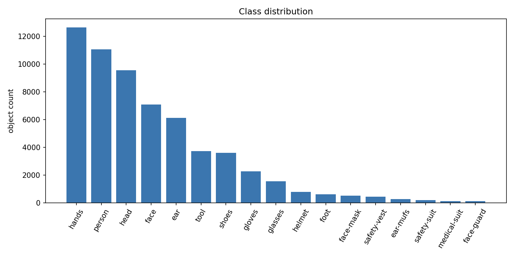
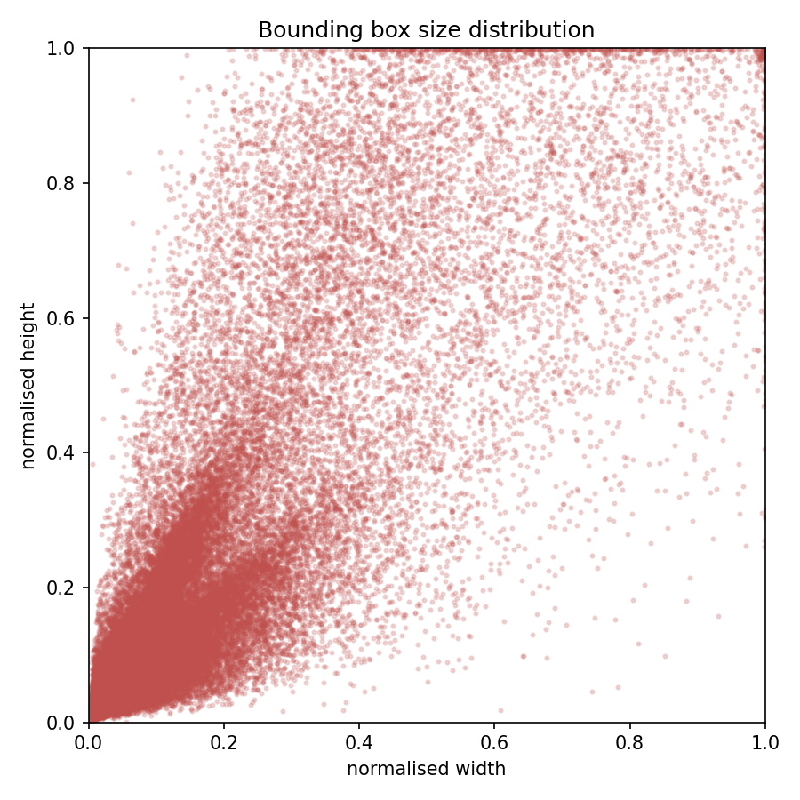
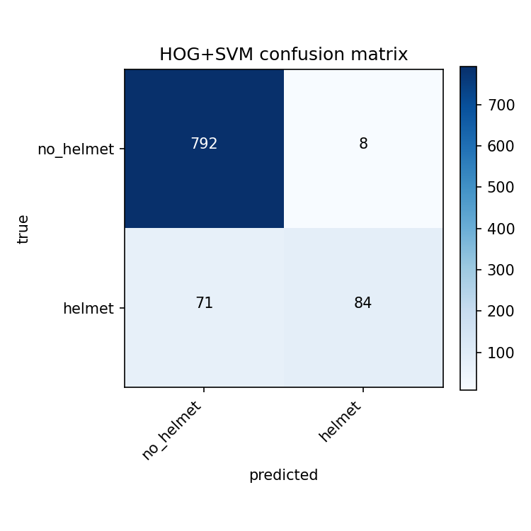
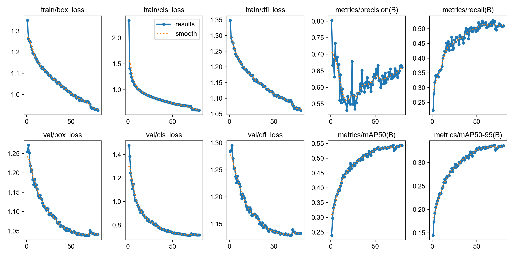
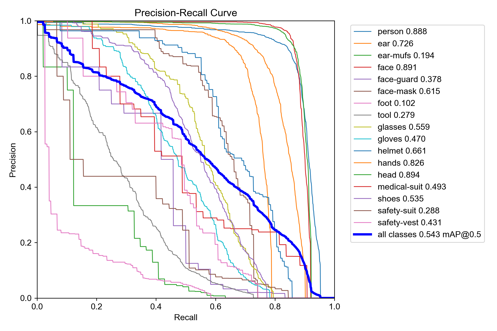
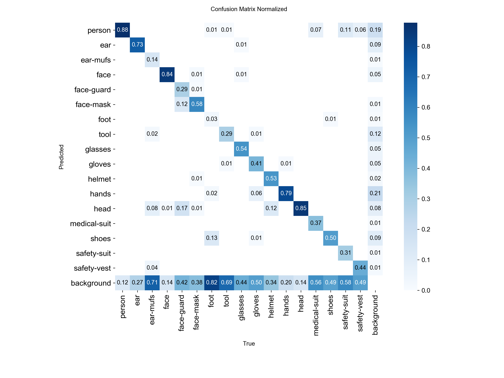
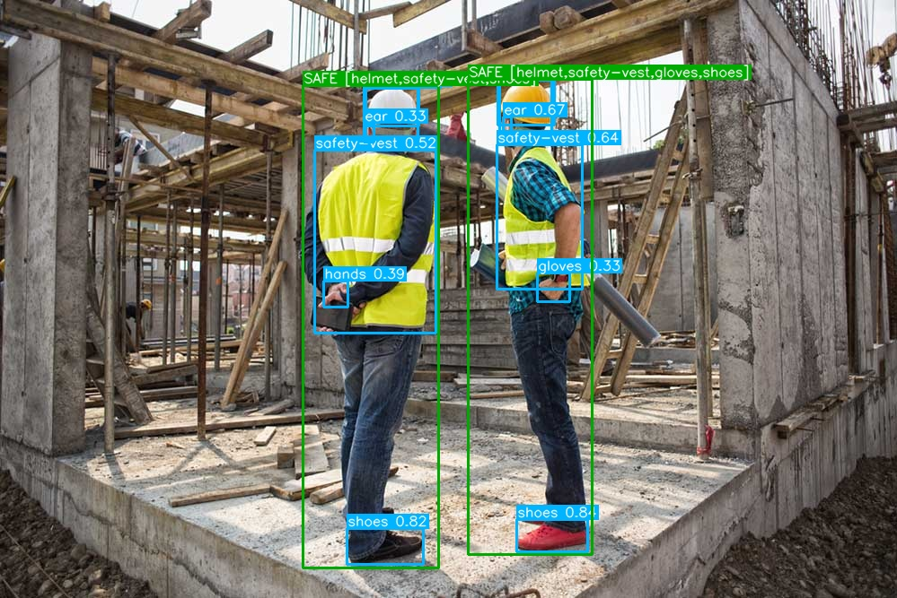

# Rilevamento DPI in cantiere e compliance di sicurezza

### Documento di analisi tecnica

**Corso:** Introduction to Computer Vision
**Progetto:** Rilevamento automatico di DPI in ambiente di cantiere
**Dataset:** SH17
**Modelli:** HOG + SVM, YOLOv8n
**Output finale:** classificazione lavoratore SAFE / PARTIALLY SAFE / UNSAFE

---

## 1. Introduzione

Il monitoraggio dell'utilizzo dei Dispositivi di Protezione Individuale (DPI) è un aspetto centrale nella gestione della sicurezza nei cantieri edili e negli ambienti industriali. Caschi, gilet ad alta visibilità, guanti, occhiali e altri dispositivi contribuiscono a ridurre il rischio di infortuni, ma la verifica della loro corretta adozione viene spesso effettuata manualmente.

Il controllo manuale presenta limiti evidenti: richiede tempo, dipende dall'attenzione dell'operatore e può diventare complesso in scene affollate, dinamiche o con scarsa visibilità. In questo contesto, la Computer Vision può fornire uno strumento di supporto per analizzare immagini o video di cantiere e segnalare potenziali situazioni di non conformità.

L'obiettivo di questo progetto è sviluppare una pipeline completa in grado di:

1. rilevare lavoratori e DPI all'interno di immagini di cantiere;
2. associare i DPI rilevati ai rispettivi lavoratori;
3. classificare ogni lavoratore come **SAFE**, **PARTIALLY SAFE** o **UNSAFE**;
4. valutare criticamente prestazioni, limiti ed errori del sistema.

Il sistema non è progettato come strumento automatico di applicazione delle norme di sicurezza. Le prestazioni ottenute, in particolare sulle classi DPI rare, non sono sufficienti per un utilizzo decisionale autonomo. Il sistema deve quindi essere interpretato come **supporto decisionale** per un operatore umano.

---

## 2. Dataset

Il progetto utilizza il dataset pubblico **SH17**, dedicato al rilevamento di lavoratori, parti del corpo e DPI in immagini di ambienti industriali e cantieri.

### 2.1 Caratteristiche principali

| Metrica                   | Valore |
| ------------------------- | -----: |
| Immagini totali           |  8.099 |
| Train                     |  6.479 |
| Validation                |  1.620 |
| Oggetti annotati totali   | 75.994 |
| Istanze di validazione    | 15.358 |
| Classi                    |     17 |
| Oggetti medi per immagine |   9.38 |

Le classi includono sia categorie di interesse diretto per la compliance, come `helmet` e `safety-vest`, sia classi di contesto o parti del corpo, come `person`, `head`, `face`, `hands`, `ear` e `foot`.

### 2.2 Distribuzione delle classi

Una delle proprietà più rilevanti del dataset è il forte sbilanciamento delle classi.



Le classi più frequenti sono legate al corpo umano:

| Classe | Istanze train | Percentuale |
| ------ | ------------: | ----------: |
| hands  |        12.638 |       20.8% |
| person |        11.068 |       18.3% |
| head   |         9.558 |       15.8% |
| face   |         7.095 |       11.7% |
| ear    |         6.118 |       10.1% |

Queste classi rappresentano circa il 77% delle istanze. Al contrario, i DPI più rilevanti per la compliance sono molto meno rappresentati:

| Classe      | Istanze train | Percentuale |
| ----------- | ------------: | ----------: |
| helmet      |           773 |        1.3% |
| safety-vest |           433 |        0.7% |

Questa distribuzione influenza direttamente i risultati finali. Il modello tende infatti ad apprendere meglio le classi frequenti e di dimensione maggiore, mentre fatica sulle classi rare e visivamente più variabili.

### 2.3 Dimensione degli oggetti

Un'ulteriore criticità riguarda la presenza di molti oggetti piccoli.



La distribuzione delle bounding box mostra una forte concentrazione di oggetti con larghezza e altezza normalizzate ridotte. Questo rende più complesso il rilevamento di:

* caschi distanti;
* gilet parzialmente visibili;
* occhiali;
* protezioni auricolari;
* lavoratori in secondo piano.

Questa proprietà del dataset è particolarmente importante perché gli oggetti piccoli tendono a generare falsi negativi, soprattutto quando appartengono anche a classi poco rappresentate.

---

## 3. Metodologia

La pipeline sviluppata segue un flusso completo di Computer Vision:

```text
Acquisition
→ Dataset audit
→ Preprocessing e augmentation
→ Baseline classica HOG + SVM
→ Detector YOLOv8n
→ Post-processing
→ Compliance engine
→ Valutazione
→ Failure analysis
```

L'approccio è stato costruito in modo progressivo: prima una baseline classica, poi un modello deep learning più adatto al problema completo di detection multi-classe.

---

## 4. Baseline classica: HOG + SVM

Prima di utilizzare YOLOv8 è stata implementata una baseline tradizionale basata su **Histogram of Oriented Gradients (HOG)** e **Support Vector Machine (SVM)**.

### 4.1 Obiettivo della baseline

La baseline non ha l'obiettivo di risolvere l'intero problema di rilevamento DPI. Lavora infatti su crop già estratti e affronta un task binario:

```text
helmet vs no_helmet
```

Il suo scopo è fornire un riferimento metodologico e mostrare i limiti delle feature handcrafted rispetto a un detector profondo.

### 4.2 Pipeline

```text
crop
→ resize 128×128
→ grayscale
→ HOG
→ StandardScaler
→ SVM RBF
```

Configurazione principale:

| Componente     | Configurazione |
| -------------- | -------------- |
| Feature        | HOG            |
| Orientazioni   | 9              |
| Celle          | 8×8            |
| Blocchi        | 2×2            |
| Classificatore | SVM RBF        |
| C              | 10             |
| Class weight   | balanced       |

Il dataset binario contiene:

| Classe   | Origine                                |   Numero crop |
| -------- | -------------------------------------- | ------------: |
| Positiva | `helmet`                               |           773 |
| Negativa | `head` senza sovrapposizione con casco | massimo 4.000 |

Totale: 4.773 crop, con split stratificato 80/20 e 955 campioni di validazione.

### 4.3 Risultati della baseline

| Metrica   | Valore |
| --------- | -----: |
| Accuracy  |  0.917 |
| Precision |  0.913 |
| Recall    |  0.542 |
| F1-score  |  0.680 |



La matrice di confusione mostra un comportamento conservativo:

|                 | Predetto no_helmet | Predetto helmet |
| --------------- | -----------------: | --------------: |
| Reale no_helmet |                792 |               8 |
| Reale helmet    |                 71 |              84 |

Il modello commette pochi falsi positivi, ma manca 71 caschi reali su 155. Questo spiega la precision elevata e la recall limitata.

### 4.4 Interpretazione

La baseline dimostra che HOG + SVM può distinguere con buona precisione crop semplici, ma non è sufficiente per il problema reale.

I limiti principali sono:

* nessuna localizzazione;
* nessuna gestione dell'immagine completa;
* classificazione binaria;
* assenza di associazione DPI-persona;
* sensibilità a occlusione, punto di vista e variabilità visiva.

Il passaggio a YOLOv8 è quindi motivato dalla necessità di affrontare detection multi-classe e localizzazione in scene complesse.

---

## 5. Detector YOLOv8n

Il modello principale è un **YOLOv8n** fine-tuned sul dataset SH17.

### 5.1 Motivazione della scelta

YOLOv8 è stato scelto perché consente:

* rilevamento multi-classe end-to-end;
* localizzazione tramite bounding box;
* tempi di inferenza compatibili con scenari real-time;
* integrazione diretta con post-processing e visualizzazione;
* buon compromesso tra costo computazionale e accuratezza.

La variante `nano` è stata scelta per mantenere il modello leggero e veloce.

### 5.2 Configurazione sperimentale

| Parametro         |                    Valore |
| ----------------- | ------------------------: |
| Modello           |                   YOLOv8n |
| Input size        |                       640 |
| Epochs            |                        80 |
| Batch size        |                        16 |
| Parametri         |                     3.0 M |
| GFLOPs            |                       8.1 |
| Hardware          |              Apple M4 Max |
| Backend           |               PyTorch MPS |
| Tempo di training |            circa 18.6 ore |
| Seed              |                        42 |
| Early stopping    | patience 20, non attivata |

Il modello è stato addestrato interamente in locale su Apple Silicon.

### 5.3 Addestramento



Le curve mostrano un andamento stabile:

* le loss di training e validation diminuiscono progressivamente;
* mAP@50 e mAP@50-95 aumentano in modo regolare;
* non si osservano instabilità marcate;
* i miglioramenti diventano più contenuti verso le ultime epoche.

Il fatto che l'early stopping non sia stato attivato indica che il modello ha continuato a migliorare fino alla fine dell'addestramento, anche se con guadagni decrescenti.

---

## 6. Risultati YOLO

La valutazione è stata eseguita sullo split ufficiale di validazione SH17:

| Dato     | Valore |
| -------- | -----: |
| Immagini |  1.620 |
| Istanze  | 15.358 |
| Classi   |     17 |

### 6.1 Metriche complessive

| Metrica            |      Valore |
| ------------------ | ----------: |
| Precision          |       0.628 |
| Recall             |       0.522 |
| mAP@50             |       0.543 |
| mAP@50-95          |       0.337 |
| Tempo di inferenza | ~2.4 ms/img |

### 6.2 Confronto con benchmark ufficiale SH17

| Modello                | Precision | Recall | mAP@50 | mAP@50-95 |
| ---------------------- | --------: | -----: | -----: | --------: |
| Nostro YOLOv8n         |     0.628 |  0.522 |  0.543 |     0.337 |
| YOLOv8n ufficiale SH17 |     0.675 |  0.536 |  0.580 |     0.366 |

Il modello si colloca a circa 3-4 punti di mAP dal benchmark ufficiale YOLOv8n pubblicato per SH17. Considerando che è stato eseguito un singolo esperimento completo in locale, il risultato è coerente con l'obiettivo del progetto.

### 6.3 Prestazioni per classe



Le prestazioni sono molto diverse tra le classi.

Classi con mAP@50 più alta:

| Classe | mAP@50 |
| ------ | -----: |
| head   |  0.894 |
| face   |  0.891 |
| person |  0.887 |
| hands  |  0.826 |
| ear    |  0.726 |
| helmet |  0.661 |

Classi con mAP@50 più bassa:

| Classe      | mAP@50 |
| ----------- | -----: |
| safety-vest |  0.431 |
| face-guard  |  0.378 |
| safety-suit |  0.288 |
| tool        |  0.279 |
| ear-mufs    |  0.194 |
| foot        |  0.102 |

Le classi più forti sono generalmente frequenti e visivamente più grandi. Le classi più deboli sono invece rare, piccole o molto variabili.

### 6.4 Matrice di confusione



La matrice di confusione normalizzata evidenzia un pattern ricorrente: molte classi rare vengono confuse con il background. Questo è particolarmente evidente per oggetti piccoli o poco rappresentati.

Il risultato conferma quanto emerso dall'analisi del dataset: le prestazioni del modello dipendono fortemente dalla distribuzione delle classi e dalla dimensione degli oggetti.

---

## 7. Motore di compliance

Il detector YOLO produce bounding box e classi. Per trasformare questi output in una valutazione di sicurezza è stato implementato un motore di compliance basato su regole.

### 7.1 Logica

Ogni DPI rilevato viene associato a un lavoratore tramite regole geometriche basate su:

* centro della bounding box;
* posizione relativa;
* overlap.

La classificazione finale segue questa logica:

| DPI rilevati sul lavoratore | Stato          |
| --------------------------- | -------------- |
| Casco + gilet               | SAFE           |
| Solo casco o solo gilet     | PARTIALLY SAFE |
| Nessuno dei due             | UNSAFE         |

Questa scelta rende il sistema interpretabile: ogni giudizio può essere ricondotto direttamente agli oggetti rilevati.

### 7.2 Esempio qualitativo



L'output visualizza i lavoratori e i DPI rilevati, mostrando il risultato della regola di compliance direttamente sull'immagine.

### 7.3 Risultati compliance

La valutazione è stata eseguita su:

| Dato                | Valore |
| ------------------- | -----: |
| Immagini            |    200 |
| Lavoratori rilevati |    333 |

Distribuzione degli stati:

| Stato          | Conteggio | Percentuale |
| -------------- | --------: | ----------: |
| UNSAFE         |       309 |       92.8% |
| PARTIALLY SAFE |        14 |        4.2% |
| SAFE           |        10 |        3.0% |

Questo risultato non deve essere letto come distribuzione reale delle violazioni. L'elevato numero di casi UNSAFE deriva in larga parte dalla mancata rilevazione dei DPI, in particolare dei gilet ad alta visibilità.

Il motore di compliance eredita quindi gli errori del detector: se il gilet non viene rilevato, il lavoratore non può essere classificato come SAFE anche quando il DPI potrebbe essere effettivamente presente.

---

## 8. Analisi degli errori

La failure analysis è stata condotta su 200 immagini di validazione tramite esportazione automatica di casi rappresentativi in `outputs/failure_cases/`.

### 8.1 Errori rilevati automaticamente

| Tipo              | Conteggio | Interpretazione                                    |
| ----------------- | --------: | -------------------------------------------------- |
| person_overcount  |        11 | più box `person` predetti rispetto al ground truth |
| person_undercount |         7 | lavoratori presenti ma non rilevati                |
| helmet_missed     |         2 | casco annotato ma non rilevato                     |

### 8.2 Principali modalità di errore

#### Caschi mancati

I caschi non rilevati sono generalmente piccoli, parzialmente occlusi o visibili da prospettive sfavorevoli. Il problema è limitato rispetto ad altre classi, ma può comunque causare falsi UNSAFE o PARTIALLY SAFE.

#### Gilet mancati

È l'errore più rilevante per la compliance. La classe `safety-vest` è rara nel dataset e ottiene mAP@50 pari a 0.431. Poiché il gilet è uno dei due DPI essenziali nella regola di compliance, ogni mancato rilevamento produce un peggioramento diretto dello stato assegnato al lavoratore.

#### Lavoratori mancati o duplicati

Nelle scene dense o con occlusioni possono verificarsi undercount e overcount. Questi errori alterano il numero di lavoratori valutati e possono generare valutazioni duplicate o assenti.

#### Classi rare

Classi come `foot`, `ear-mufs`, `safety-suit` e `face-guard` mostrano prestazioni basse. Il problema è coerente con la scarsa numerosità delle istanze e con la dimensione ridotta degli oggetti.

#### Associazione DPI-persona errata

Quando più lavoratori sono sovrapposti, una regola geometrica semplice può associare un DPI alla persona sbagliata. Questo limite potrebbe essere mitigato con tracking o pose estimation.

### 8.3 Interpretazione complessiva

Il principale limite del sistema non è il rilevamento delle persone, che risulta solido, ma il rilevamento dei DPI rari.

In particolare, il gilet ad alta visibilità rappresenta il collo di bottiglia principale: è raro nel dataset, difficile da rilevare e direttamente necessario per classificare un lavoratore come SAFE.

---

## 9. Considerazioni etiche

Un sistema di questo tipo richiede particolare attenzione agli aspetti etici e organizzativi.

### 9.1 Falsi positivi e falsi negativi

L'elevata percentuale di UNSAFE osservata nella valutazione non corrisponde necessariamente a reali violazioni. In molti casi è causata da DPI non rilevati.

Usare il sistema come strumento automatico di controllo potrebbe quindi produrre:

* falsi allarmi;
* perdita di fiducia nel sistema;
* decisioni ingiuste verso i lavoratori.

### 9.2 Privacy

Le immagini di cantiere possono contenere persone identificabili. Un'eventuale applicazione reale dovrebbe prevedere:

* minimizzazione dei dati;
* anonimizzazione quando possibile;
* politiche chiare di conservazione;
* accesso controllato alle immagini.

### 9.3 Sorveglianza e uso improprio

Il sistema non deve essere interpretato come strumento punitivo. Il suo ruolo corretto è quello di supportare la supervisione umana e aiutare a identificare situazioni da verificare.

### 9.4 Responsabilità

La decisione finale deve rimanere umana. Il modello può segnalare potenziali criticità, ma non può sostituire il giudizio di un responsabile della sicurezza.

---

## 10. Limiti del progetto

Il progetto presenta alcuni limiti rilevanti.

### 10.1 Un solo dataset

La valutazione è stata condotta esclusivamente su SH17. Non è quindi possibile misurare la generalizzazione su cantieri reali diversi da quelli rappresentati nel dataset.

### 10.2 Un solo esperimento completo

A causa del costo computazionale, è stato eseguito un solo training completo YOLOv8n da 80 epoche. Non sono state condotte ablation sistematiche su augmentation, soglie o architetture alternative.

### 10.3 Nessun confronto con modelli più grandi

Il confronto con YOLOv8s è stato considerato come lavoro futuro, ma non eseguito nel ciclo principale.

### 10.4 Compliance basata su regole semplici

La regola centro-nel-box / overlap è interpretabile ma fragile in caso di occlusioni o persone sovrapposte.

---

## 11. Sviluppi futuri

Le direzioni di miglioramento più rilevanti sono:

* oversampling dei DPI rari;
* class weighting o loss pesate per `helmet` e `safety-vest`;
* copy-paste augmentation per aumentare la varietà dei DPI;
* inferenza a risoluzione più alta;
* tiling per oggetti piccoli;
* tuning delle soglie di confidenza per classe;
* tracking multi-frame per stabilizzare persone e DPI;
* associazione DPI-persona tramite pose estimation;
* confronto con YOLOv8s;
* validazione su immagini o video provenienti da altri contesti.

La priorità principale dovrebbe essere il miglioramento del rilevamento dei gilet, perché è il fattore che più influenza la classificazione di compliance.

---

## 12. Conclusioni

Il progetto dimostra la fattibilità di una pipeline completa per il rilevamento dei DPI e la valutazione della compliance in immagini di cantiere.

Il modello YOLOv8n raggiunge:

| Metrica            |      Valore |
| ------------------ | ----------: |
| mAP@50             |       0.543 |
| mAP@50-95          |       0.337 |
| Precision          |       0.628 |
| Recall             |       0.522 |
| Tempo di inferenza | ~2.4 ms/img |

Questi risultati sono vicini al benchmark ufficiale SH17 per YOLOv8n e confermano l'efficacia dell'approccio deep learning rispetto alla baseline classica.

La baseline HOG + SVM ottiene buone metriche sul task binario helmet/no_helmet, ma non può risolvere il problema completo perché non localizza gli oggetti e non gestisce scene multi-classe.

La failure analysis mostra che il limite principale non è la rilevazione delle persone, ma il riconoscimento dei DPI rari, soprattutto `safety-vest`. Questo limite si riflette direttamente sulla compliance, generando molti falsi UNSAFE.

In conclusione, il sistema è adatto come prototipo e come supporto decisionale, ma non come strumento automatico di controllo. Per un utilizzo operativo sarebbe necessario migliorare la qualità dei dati sulle classi rare, validare il modello su nuovi scenari e mantenere sempre un operatore umano nel processo decisionale.

---

## Riferimenti

* SH17 Dataset — https://github.com/ahmadmughees/SH17dataset
* Ultralytics YOLO — https://docs.ultralytics.com
* Dalal, N. & Triggs, B. — *Histograms of Oriented Gradients for Human Detection*, CVPR 2005
